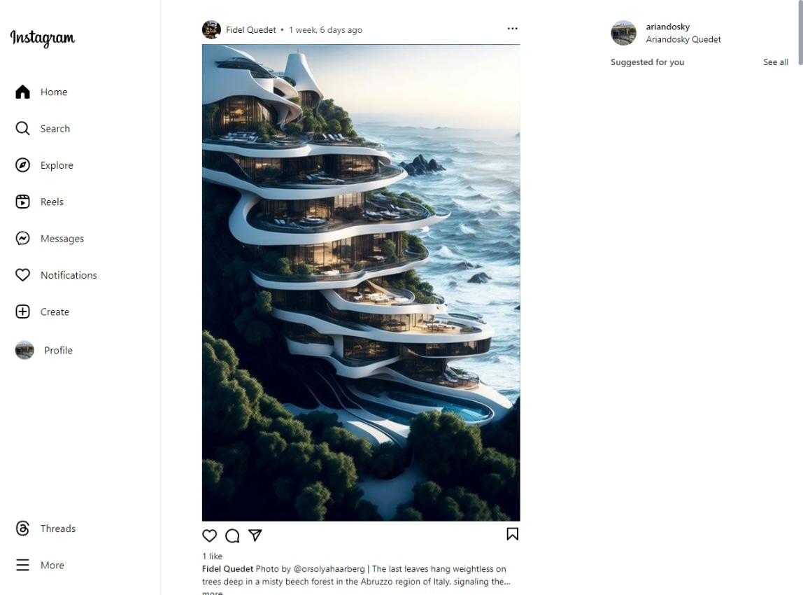

# flx-instagram (Instagram Clone)

Developed an Instagram-like platform using HTML, CSS, JavaScript, Django, and PostgreSQL, to mimic the core features of the Instagram platform. It allows users to create accounts, share photos, follow other users, like and comment on posts, and explore content from various users.

Main features:

- User authentication system for secure logins and sessions,
- Video upload functionality with content storage and retrieval,
- Commenting system for user engagement and interaction,
- Chatting privately (Direct Messaging or DM),
- Share temporary content that disappears after 24 hours (stories)
- Explore Page, Reels and save posts to collections for future reference or inspiration,
- Responsive design for various devices and screen sizes
